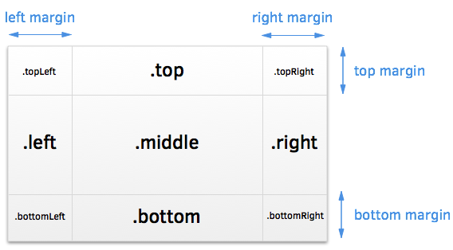

famous-boxlayout
==========

Box-layout is a simple yet powerful layout view for famo.us to:

* Quickly add margins to a renderable
* Link a renderable to an marginated region (e.g. add a border surface)

Box-layout takes an margins argument as input and then creates a layout accordingly. 
Box-layout is intended to be very lightweight and will only create layout-contents and properties for which an margin was specified. For instance, if all margins would be set to 0, then box-layout would create only one modifier, wrapped in a RenderNode, and that would be assigned to ```.middle```.

A secondary goal of Box-layout is to reduce boilerplate code that you need to write when using layout-views such as GridLayout or FlexibleLayout. Because Box-layout exposes the renderables as properties, you can simple call ```<property>.add()``` to add modifiers and surfaces. Box-layout is modelled after the HeaderFooterLayout view and should be very familiar to use.



### [View the demo here](https://rawgit.com/IjzerenHein/famous-boxlayout/master/examples/demo/index.html)

## Getting started

Install using bower:
	
	bower install famous-boxlayout
	
If necessary, add to the requirejs paths config:

```javascript
require.config({
    paths: {
        ...
        'famous-boxlayout': 'bower_components/famous-boxlayout/BoxLayout',
        ...
    }
});
```

Create a surface with 20px margins all around:

```javascript
var BoxLayout = require('famous-boxlayout');

var boxLayout = new BoxLayout({ margins: [20] });
this.add(boxLayout);
boxLayout.middle.add(new Surface());
```

Create a surface with a 20px right margin:

```javascript
var boxLayout = new BoxLayout({ margins: [0, 20, 0, 0] });
this.add(boxLayout);
boxLayout.middle.add(new Surface());
```

## Margins

The margins array is oriented in a clockwise manner: [top, right, bottom, left].
For convenience, the following shorthand notations can be used:

+ **margins: [25, 50, 75, 100]**
  - top margin is 25px
  - right margin is 50px
  - bottom margin is 75px
  - left margin is 100px
+ **margins: [25, 50]**
  - top and bottom margin are 25px
  - right and left margin are 50px
+ **margins: [25]**
  - all four margins are 25px

## Properties

Dependent on which margins are specified, properties are created to which renderables can be added.

|Property|Description|
|--------|-----------|
|```.topLeft```|Top-left area, only created when both **top- and left**-margin are specified.|
|```.top```|Top area, only created when **top-margin** is specified.|
|```.topRight```|Top-right area, only created when both **top- and right-margin** are specified.|
|```.left```|Left area, only created when **left-margin** is specified.|
|```.middle```|Middle content, **always created**.|
|```.right```|Right area, only created when **right-margin** is specified.|
|```.bottomLeft```|Bottom-left area, only created when both **bottom- and left-margin** are specified.|
|```.bottom```|Bottom area, only created when **bottom-margin** is specified.|
|```.bottomRight```|Bottom-right area, only created when both **bottom- and right-margin** are specified.|

Example:

```javascript
var boxLayout = new BoxLayout({ margins: [0, 20] });
this.add(boxLayout);
boxLayout.left.add(new Surface({properties: {backgroundColor: 'red'}}));
boxLayout.right.add(new Surface({properties: {backgroundColor: 'red'}}));

// The following line would throw an error because the top-margin is not set, 
// and thus .top is not created.
boxLayout.top.add(new Surface({properties: {backgroundColor: 'red'}}));
```

## Contribute

Feel free to contribute to this project in any way. The easiest way to support this project is by giving it a star.

## Contact
- 	@IjzerenHein
- 	http://www.gloey.nl
- 	hrutjes@gmail.com

© 2014 - Hein Rutjes